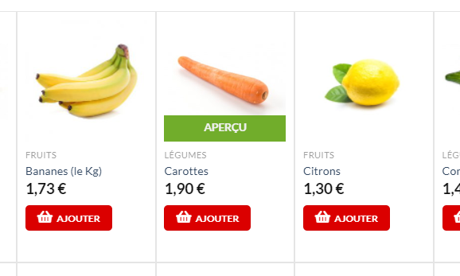
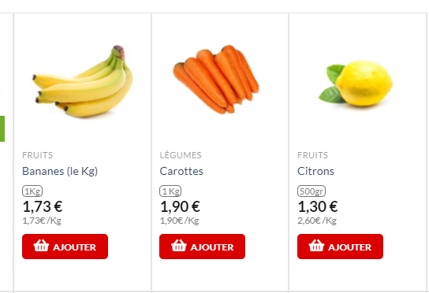
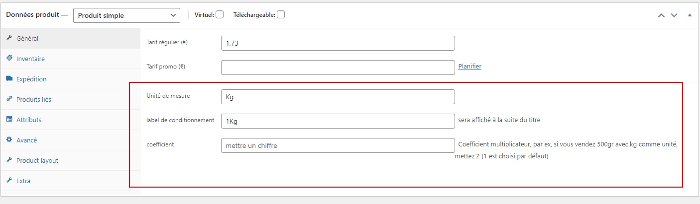

Ce plugin permet d'ajouter le prix au kg ou autre unité pour se conformer à la loi.

# Avant

# Après

# mode d'emploi

1- Ajouter l'extension zippée et l'activer . 

2 - dans le menu géneral des produits vous pouvez remplir 3 lignes pour renseigner l'unite de mesure, le label de conditionnement et le coefficient à utiliser (par exemple 2 pour 500 grs).

